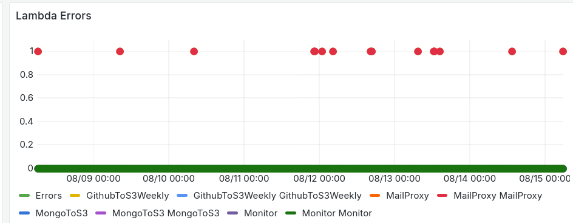

The previous setup was too confusing, too complex, and caused frequent errors, so like right now I am using a simpler setup

SMTP server is the same. Basically update all the records in Route 53.

Then configure Workmail, Create Organization, Update records in Route 53 again too.

**AWS will create a default email receiving rule for you if you create a workmail(THIS IS VERY CONFUSING)**

Then add the "backup to s3" in the rule.

**The inbound and Outbound server gets automatically integrated in the workmail to SES**

### Inbound (IMAP)

- Server: imap.mail.us-east-1.awsapps.com
- Port: 993
- Security: SSL/TLS
- Username: Full email (IMAP email)
- Password: WorkMail password

### Outbound (SMTP)

- Server: smtp.mail.us-east-1.awsapps.com
- Port: 465
- Security: SSL/TLS

## Previous Errors

