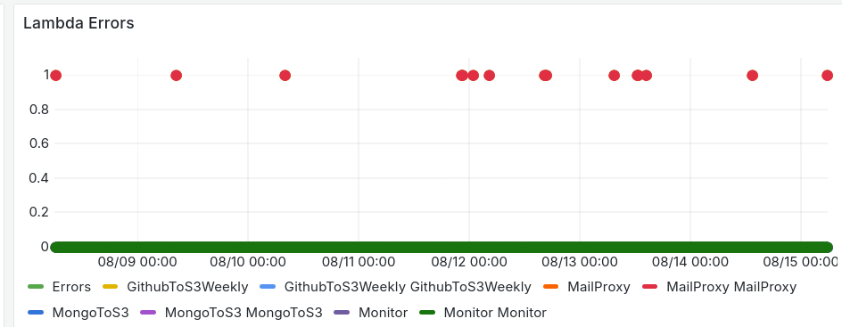

The previous setup was too confusing, too complex, and caused frequent errors, so like right now I am using a simpler setup

SMTP server is the same. Basically update all the records in Route 53.

Then configure Workmail, Create Organization, Update records in Route 53 again too.

AWS will create a default email receiving rule for you if you create a workmail(THIS IS VERY CONFUSING)

### Inbound (IMAP)

- Server: imap.mail.us-east-1.awsapps.com
- Port: 993
- Security: SSL
- Username: Full email (IMAP email)
- Password: WorkMail password

### Outbound (SMTP)

- Server: email-smtp.us-east-1.amazonaws.com
- Port: 465
- Security: TLS
- Username: IMAP user access key
- Password: IMAP user secret key

## Previous Errors

